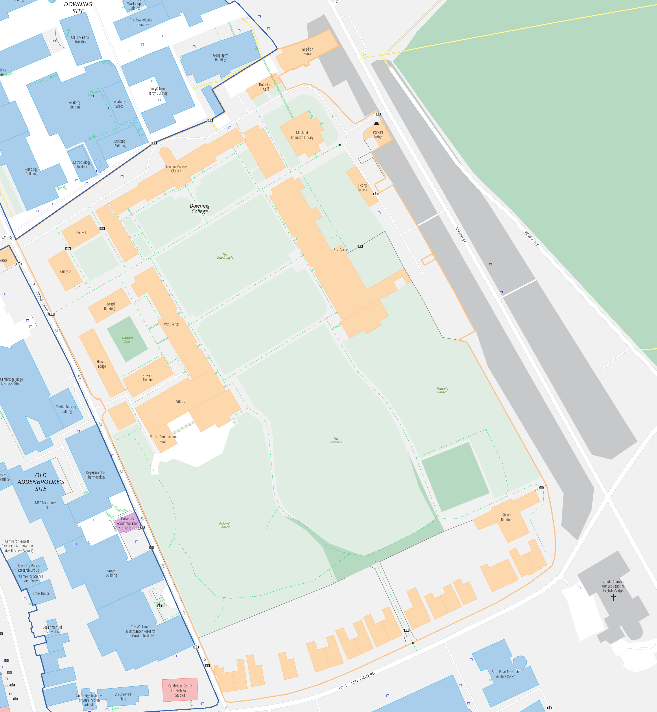

# Map Area Calculator
## Introduction
This python script was created to measure the areas of green spaces within College grounds in Cambridge as seen on the [University Map](https://map.cam.ac.uk). It could come in handy for any task that requires color-based area measurements from images. 

## Requirements
```shell
pip3 freeze
numpy==1.19.4
opencv-python==4.4.0.46
pathlib==1.0.1
```

## What it does
For each image in a folder:
1. Computes a mask to fill in contours of a certain colour (in my case, it looks for the orange borders lines of College sites and fills them in);
2. Computes a mask corresponding to all pixels of a certain colour (e.g. green for lawns);
3. Computes the intersection (binary 'and') of the two masks to extract the target areas enclosed by contours;
4. Counts the pixels in this intersection and converts them to m<sup>2</sup> area based on a scale encoded in the image filename (e.g. "Namei\_25m\_150px.png" means that 150 pixels in the image correspond to 25 metres in reality"). 

## Usage
```shell
$ python3 main.py --dataset images --verbose --results results.csv --save results
```
* --dataset [folder] is the folder containing the images to be processed
* --verbose will show the image processing steps on-screen
* --results [file.csv] specifies the file in which to write the measurements in the form College,[area]
* --save (optional) specifies a folder (will be created if necessary) to output the processed images for debugging

## Cambridge-specific notes
* Additional College sites are not given in a separate image file if the algorithm was able to connect these to the nearby main College site (e.g. Peterhouse's Cosin Court).
* Queen's Owlstone Croft was omitted because it is adjacent to a nature reserve.
* It was not my aim to include sports grounds, but some (e.g. Jesus) could not be excluded from the main site when computing areas.
